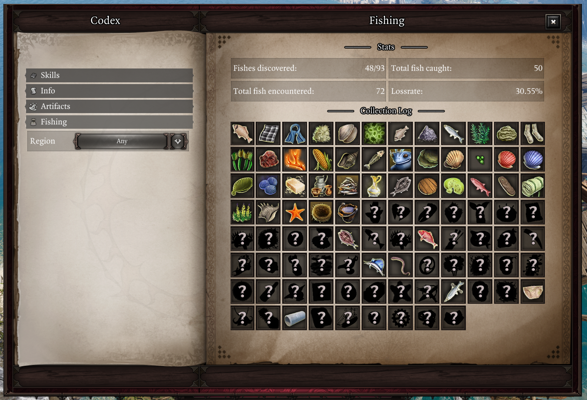
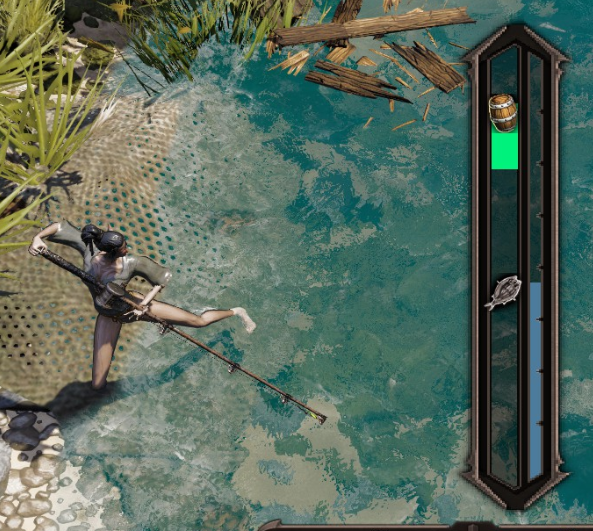

# Fishing

Fishing is a new system in *Fishermancy Class Overhaul Ultimate*, consisting of a Stardew Valley-inspired minigame, with over 90 fish species to catch across 50+ fishing spots in Rivellon.

<video autoplay muted loop playsinline><source src="../img/fishing_hard.webm" type="video/webm"></video>

You can fish just about everywhere where there's a body of water, and different fishing *regions* will have different species of fish. To catch them all, you'll have to explore many fishing spots throughout all acts!

To start fishing, stand near water with a fishing rod equipped and unsheathed, then use ++m1++ to cast the line!

You'll have to wait for a fish to bite, indicated by a sound and exclamation mark FX - when that happens, use ++m1++ again to start reeling in the fish and begin the reeling minigame!

## Minigame

Once a fish bites, a fishing minigame begins to reel in the fish, inspired by *Stardew Valley*. Your goal is to keep your bobber aligned with the fish until the progress bar fills to 100% to catch it, using ++m1++ to raise the bobber and letting go to let it fall.

Different fish have different [behaviours](Fish Behaviors.md) that affect how they move - some are calm and predictable, others erratic or darting. Harder fish may also take longer to reel in.

The progress bar drains while the bobber is not by the fish; if it reaches 0%, the fish escapes.

Several character stats provide bonuses in the minigame, [as described below](#stat-bonuses).

## Fishing Regions

Throughout Rivellon there are many fishing **regions** with different fish to catch. Aside from seas and river, you can find fishing spots in more unusual places, so keep an eye out for any place where you could cast your rod!

**Regions have a limited number of fish at a time**, which respawn every ~15 minutes. Areas with more water unsurprisingly house more fish. Once a region is depleted, you won't be able to cast your rod there anymore until it replenishes.

Aside from waiting for fish to respawn, you can use **bait** (sold by [the trader](../Pip.md)) to spawn more fish in the region.

## Collection Log

To help track your fishing journey, a new Fishing "Collection Log" section has been added to Epip's Codex, opened with ++shift+F++.

<i>The Fishing Collection Log</i>

The Collection Log tracks your discovered fish and various statistics, such as the amount of times you've caught each species.

Once you've discovered a species, you can use the Collection Log to check its habitats - making it easier to farm specific fish for their [fish essences](FishEssence.md).

Likewise, discovering a region will give you hints on the fish that can be caught there to aid with catching 'em all!

The [fishing trader, Pip](Trader/index.md), can show you how to use the collection log, and can appraise your collection as it grows.

Most fish species are available throughout at least 2 acts, so you need not obsess over fully exploring each act to complete your collection.

## Stat bonuses

Several character stats provide bonuses in the fishing minigame. Make sure to build accordingly to fit your fishing style!

### Civil ability bonuses

- **Persuasion**: Decreases the time until fishes bite while casting.
- **Bartering**: Grants a chance to catch an additional fish of the same kind.
- **Lucky Charm**: Increases the chance to encounter [treasure](#Treasure) while fishing.
    - This bonus is shared across the party (ie. highest amount among all party members is used).
- **Thievery**: Decreases capture progress drain while reeling in treasure.
- **Sneaking**: Grants a chance to avoid depleting the region's fish supply when casting.
- **Loremaster**: Allows you to identify the effects of higher-rarity [fish essences](../FishEssences.md).
- **Telekinesis**: Increases how far away you can cast your rod.

### Defensive ability bonuses

- **Leadership**: Increases the starting capture progress, giving you a headstart.
- **Perseverance**: Decreases capture progress drain when not reeling in the fish.
- **Retribution**: Grants capture progress whenever the fish escapes the bobber area (with a cooldown).

## Fishermancy

Catching more fish and discovering new species increases your Fishermancy skill ability, which unlocks new skills as described in the [Fishermancy](../Fishermancy/index.md) page.

Additionally, your bobber size in the minigame increases with each Fishermancy point, making it easier to catch fish, especially higher-rarity ones that have trickier movement patterns.

## Treasure

While reeling in, there is a small chance for treasure to appear, indicated by FX similar to Lucky Charm procs.

If you keep your bobber over the treasure until it's captured, you'll gain the treasure after finishing catching the fish!

The treasure you can fish up consists of various of containers you'd normally find in Rivellon, along with their usual rewards of gold, consumables, and equipment within - complementing your usual looting.

Lucky Charm increases the chance for treasure to appear, and this bonus is shared across the party.

Beware, as your capture progress will drain while reeling in treasure, if the fish is not also near the bobber. The Thievery stat can mitigate this, reducing progress drain while reeling in treasure.
