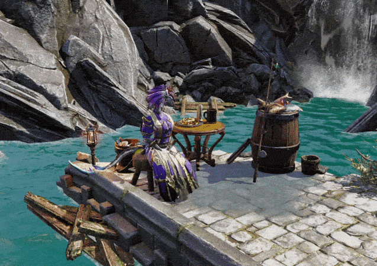
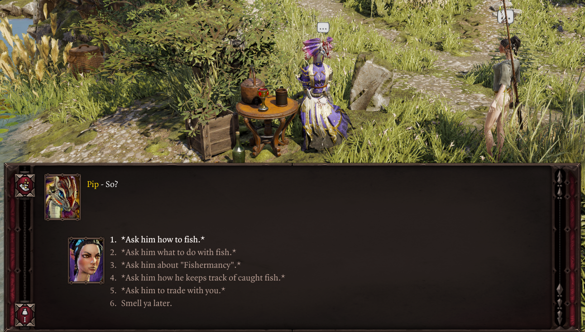

# Fishing Trader

A new trader NPC, Pip himself, has been added to handle all your fishing-related needs, by selling fishing supplies, appraising your collection, and teaching newcomers the art of fishing.

In Fort Joy, you can find Pip by the waypoint in the starting beach, and he travels to the other acts as well.

<i>Pip's fishing spot near the Fort Joy Beach waypoint.</i>

Pip Locations

- Reaper's Coast: west of Driftwood Fields, by the Cloisterwood river.
- Nameless Isle: northeast coast, near the Murky Cave.
- Arx: in the Lizard Consulate gardens.

Pip offers multiple services:

- Fishing tutorials
- [Fishermancy](../Fishermancy/index.md) skillbooks and info
- Appraisal of your fish collection, complimenting you on your fishing journey.
- Fishing-related supplies. His stock includes:
    - Fishing rods
    - Fishing bait, which allows you to spawn more fish
    - Miscellaneous crafting ingredients

Since he's on vacation, he also has much banter and knowledge to share with you, so do stop by for a chat often!

## Collection Log

Talking to Pip opens your **Collection Log** — a record of every fish species you've discovered and caught. Pip's dialogue reflects your overall completion, commenting on your progress in 10% increments.

Use the Collection Log to track which species you're still missing and which regions you might not have explored yet.

