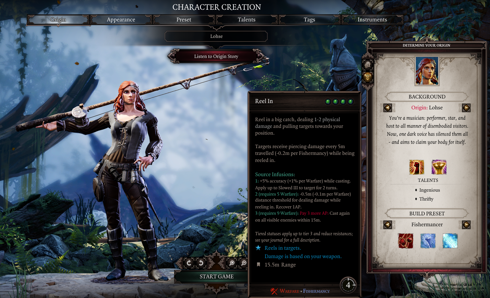
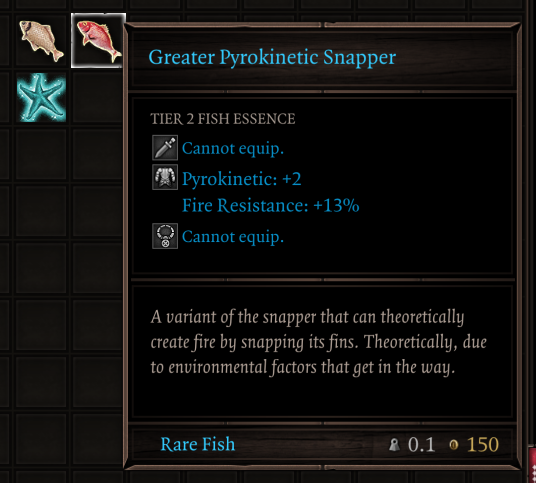

# Fishermancy Class Overhaul Ultimate

!!! info ""
    
🐟 ***The seas are silent. Fish bleed. New shenanigans stir.*** 🎣

**Fishermancy Class Overhaul Ultimate** is a mod for *Divinity: Original Sin 2* that adds a full-fledged **fishing minigame**, a new **Fishermancy** skill school, and new fishing-related progression systems.

<video autoplay muted loop playsinline><source src="img/intro.webm" type="video/webm"></video>

**Main features:**

- A full-fledged [Fishing minigame](Fishing/index.md) with 90+ fish species to catch across 50+ fishing spots in all acts.
- The new [Fishermancy](Fishermancy/index.md) skill school, with 10 hybrid skills and Epic Encounters support.
- Improve your gear with [fish essences](FishEssences/index.md), slotting in your caught fish as runes for fishy bonuses.
- Track your catches and get appraisals on your collection from the new [Fishing trader NPC](Trader/index.md).

!!! info ""
    See the [Installation & Patchnotes](patchnotes.md) page for downloads, and browse the mod's main features below to get started!

## [Fishing](Fishing/index.md)

Fishing is a new core mechanic in *Fishermancy Class Overhaul Ultimate*, featuring a minigame inspired by *Stardew Valley*'s fishing. Grab your previously-useless fishing rod and set out to catch over 90 fishes throughout 50+ fishing spots across Rivellon!

<video autoplay muted loop playsinline><source src="img/fishing_hard.webm" type="video/webm"></video>

??? tip "How to fish!"
    1. Equip a fishing rod and unsheathe it.
        - You'll find some scattered throughout the world, or can buy them from the new [fishing trader](Trader/index.md).
    2. Stand near water, hover over it with your cursor and use ++m1++ to cast your rod.
    3. Wait patiently until a fish bites (indicated by a sound + overhead exclamation mark), then press ++m1++ to start reeling!
    4. A minigame will begin: keep the bobber aligned with the fish to reel it in!
        - Hold ++m1++ to raise the bobber, or let go to have it fall.
    5. Keep the bobber aligned with the fish until the progress bar fills to catch it!

There are over 50 fishing spots throughout Rivellon hosting over 90 fish species, with varying rarities and behaviours - some drift lazily, others will pose a greater challenge to catch them.

Your character's ability and civil points affect certain aspects of the minigame: fish bite faster for characters with high Persuasion, Lucky Charm lets you fish up treasures, Telekinesis lets you cast further, and more - be sure to build for fishing to match your playstyle! 

Catching fish increases your **Fishermancy** skill ability, which unlocks new skills as described below, and makes catching harder fish easier.

See the [Fishing](Fishing/index.md) section for full details.

## [Fishermancy](Fishermancy/index.md)

**Fishermancy** is a new skill school featuring 10 hybrid skills that grant fishy new combat options, focusing on a new ***Seasick*** status that synergizes with water damage.

<video autoplay muted loop playsinline><source src="img/skills_showcase.webm" type="video/webm"></video>

!!! info ""
    Unlike normal skill abilities, you cannot invest points into Fishermancy.
    
    Instead, your Fishermancy levels up as you catch more fish and discover new species. You'll have to grow as an angler to unleash its full potential!

Fishermancy skillbooks can be purchased from the [fishing trader](Trader/index.md).

Additionally, a new **Fishermancer class preset** is available during Character Creation, which starts with Fishermancy skills and a trusty ol' rod to get started on your fishing journey right away!

<i>The Fishermancer class preset, fully decked-out for the job.</i>

See the [Fishermancy](Fishermancy/index.md) section for the full skill list.

## [Fish Essences](FishEssences/index.md)

The fish you catch are all juicy with fish essences that can be squeezed into your gear to empower them, acting as runes.

<i>Every fish is full of oils that can be used as a rune.</i>

Higher-rarity fish carry stronger bonuses, and combining 4 fish of the same kind upgrades them to higher tiers with stronger fish essence bonuses.

See the [Fish Essences](FishEssences/index.md) page for full details.

## [Fishing Trader](Trader/index.md)

**A new trader NPC, Pip himself**, has been added to handle all your fishing-related needs, selling fishing rods, Fishermancy skillbooks, appraising your collection, and teaching newcomers the art of fishing. He's the perfect guy to go to if you want to learn the basics of the mod!

<i>Pip's fishing spot near the Fort Joy Beach waypoint.</i>

Pip can be found by the waypoint in the starting beach in Fort Joy, and appears in all subsequent acts as well, offering an immersive fishing tutorial and environmental storytelling (mostly meme banter).

See the [Fishing Trader](Trader/index.md) page for more details.
